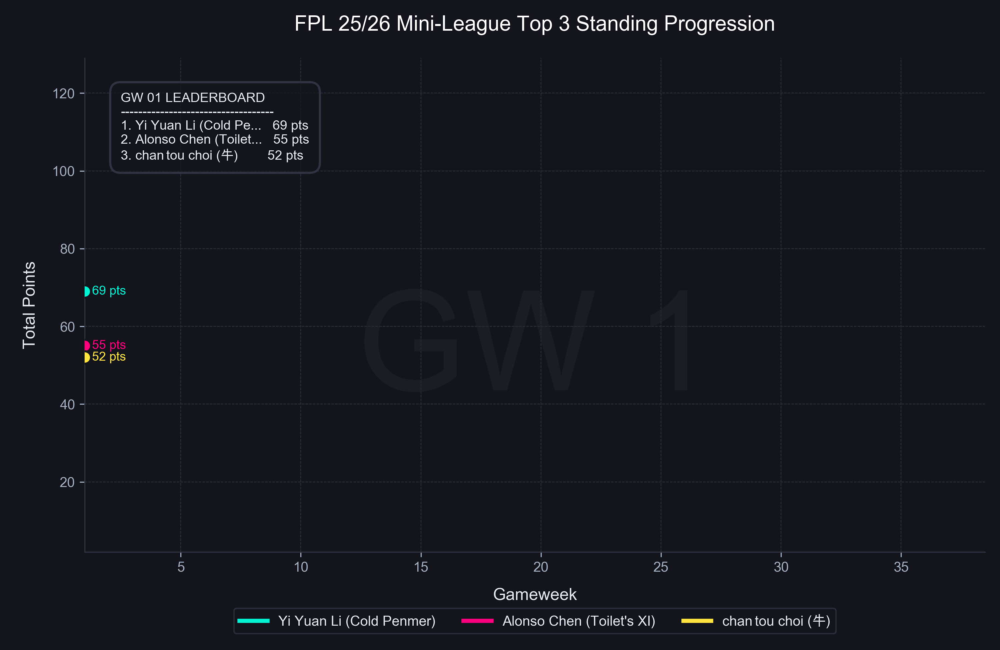

# FPL Standings Progression Visualizer / FPL 积分排名动态可视化生成器

[English](#english) | [中文说明](#中文说明)

---

## English

An elegant Python tool to visualize the standing/lead changes of the top 3 players in a Fantasy Premier League (FPL) mini-league. It fetches live data from the FPL API and renders a buttery-smooth, 24fps animated video (or loopable GIF) showing their cumulative points progression gameweek by gameweek.

### Showcase



### Features

- **Live FPL API Integration**: Dynamically fetches the current classic mini-league standings and players' week-by-week historical points.
- **Smooth Interpolation**: Interpolates 8 sub-frames between each gameweek to produce a 24fps fluid rendering.
- **Neon Dark Theme**: Sleek background, grid lines, glowing lines for players, and a monospace running scoreboard that displays real-time standings.
- **Mac/iOS Playback Compatible**: Output video uses H.264 video codec and `yuv420p` color space to play natively in QuickTime and Safari.

### Installation

1. Clone this repository:
   ```bash
   git clone https://github.com/yiyuanlee/fpl_standing_gif.git
   cd fpl_standing_gif
   ```
2. Set up a Python virtual environment:
   ```bash
   python3 -m venv venv
   source venv/bin/activate
   ```
3. Install the dependencies:
   ```bash
   pip install -r requirements.txt
   ```

### Usage

#### Generate MP4 Video (Recommended)
Run the video generator script. This will download a static `ffmpeg` build inside the environment and compile a smooth 24fps video:
```bash
python generate_video.py
```

#### Generate GIF
If you want to compile a loopable GIF instead:
```bash
python generate_gif.py
```

---

## 中文说明

一个优雅的 Python 脚本工具，用于可视化 Fantasy Premier League (FPL) 迷你联赛中前三名玩家的积分与排名变动。它能自动从 FPL 官方 API 获取最新数据，并生成 24fps 的超平滑动画视频（或循环 GIF 图），展示每个 Gameweek 结束后的累计积分变化。

### 效果展示


### 功能特点

- **FPL 官方 API 对接**：动态拉取指定 Classic 迷你联赛的当前排名以及前三名用户的历史每轮得分。
- **平滑动画插值**：在每两个 Gameweek 之间插值 8 帧，生成 24fps 的高帧率视频，让曲线延伸和标记点的移动丝滑顺畅。
- **霓虹暗黑主题**：精心调配的深色背景、暗格网格线、选手专属的荧光发光曲线，以及实时滚动分数的等宽字体记分板。
- **Mac/iOS 原生播放兼容**：生成的 MP4 视频采用 H.264 编码与 `yuv420p` 像素格式，可在 macOS QuickTime 及 iOS Safari 中完美流畅播放。

### 安装步骤

1. 克隆本仓库：
   ```bash
   git clone https://github.com/yiyuanlee/fpl_standing_gif.git
   cd fpl_standing_gif
   ```
2. 创建并激活 Python 虚拟环境：
   ```bash
   python3 -m venv venv
   source venv/bin/activate
   ```
3. 安装依赖包：
   ```bash
   pip install -r requirements.txt
   ```

### 使用指南

#### 生成 MP4 视频（推荐）
运行视频生成脚本，该脚本会自动在虚拟环境中配置 `ffmpeg` 依赖并生成 24fps 丝滑视频：
```bash
python generate_video.py
```

#### 生成 GIF 动图
如果您希望生成循环播放的 GIF 动图，可以运行：
```bash
python generate_gif.py
```

---

### Customization / 自定义修改

You can change the target mini-league ID in the scripts. In both `generate_video.py` and `generate_gif.py`, update the `league_url`:

您可以在脚本中修改目标迷你联赛 ID。在 `generate_video.py` 和 `generate_gif.py` 中更新 `league_url`：
```python
league_url = "https://fantasy.premierleague.com/api/leagues-classic/<YOUR_LEAGUE_ID>/standings/"
```
